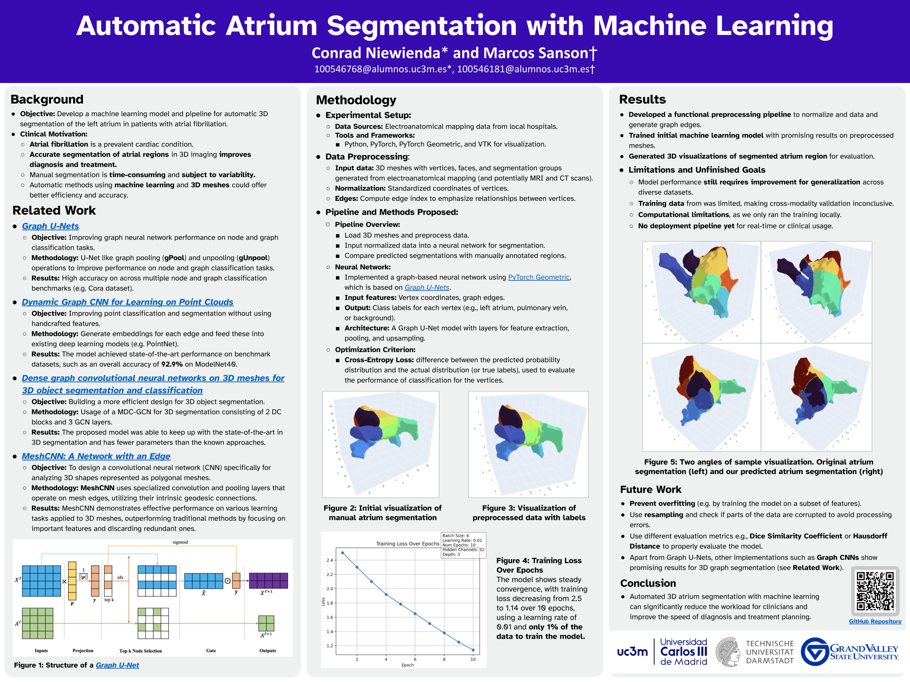

# Automatic Atrium Segmentation Project

## Research Project Overview

**Project Title**: Automatic Atrium Segmentation with Machine Learning

### Project Mentors
- **Dr. Gonzalo Ricardo Ríos Muñoz**: Assistant Professor, Bioengineering Department
- **Dr. Pablo Martínez Olmos**: Associate Professor, Signal Theory and Communications Department
- **Dr. Antonio Artés Rodríguez**: Professor, Signal Theory and Communications Department

### Students
- **Conrad Niewienda**
- **Marcos Sanson**

**Institution**: Universidad Carlos III de Madrid

### Project Description
This research project focuses on developing an algorithm for automatic 3D segmentation of the left atrium, particularly in patients with atrial fibrillation. The segmentation is performed on 3D meshes generated from electroanatomical mapping and other medical imaging data, such as MRI and CT scans.

The main objectives include:
- Preprocessing raw 3D data from medical imaging.
- Normalizing and resampling mesh coordinates for efficient processing.
- Building machine learning models for aligning and segmenting atrial regions.
- Implementing a data pipeline for normalization, feature selection, and resampling.
- Evaluating segmentation results by comparing predicted regions with manually annotated data.

The work is conducted as part of the **[Machine Learning in Healthcare](https://aplicaciones.uc3m.es/cpa/generaFicha?est=350&anio=2024&plan=392&asig=16803&idioma=2)** course at **[Universidad Carlos III de Madrid (UC3M)](https://www.uc3m.es/home)**, in collaboration with local hospitals.

## Project Resources

### Poster Presentation

You can view our project's poster using the links below:

- **PDF Version**: [Download Poster PDF](docs/Automatic_Atrium_Segmentation_Poster.pdf)
- **PNG Version**:  
  

## Research Involvement and Contributions

### Key Tasks and Contributions
- **Mesh Preprocessing**: Working with raw 3D meshes to preprocess and normalize data for segmentation purposes.
- **Data Pipeline Development**: Developing a complete pipeline for normalizing mesh coordinates, selecting relevant features, and resampling meshes for efficiency.
- **Machine Learning Models**: Building and training machine learning models to align 3D meshes and perform segmentation, particularly focusing on the left atrium and pulmonary veins.
- **Evaluation**: Comparing automatic segmentation results against manually labeled datasets, refining algorithms to improve segmentation quality.
- **Neural Network Implementation**: Exploring the use of neural networks to improve segmentation accuracy and optimize transformations for better alignment of medical imaging data.

The project aims to advance the understanding and applicability of machine learning in cardiac imaging, with a focus on assisting in diagnosing and treating atrial fibrillation patients. The contributions are designed to refine segmentation techniques and ensure robustness across various patient datasets.

## Installation and Setup Instructions

To set up the environment for this project, please follow the instructions below.

### Prerequisites
- **Python 3.9.4 or below** is recommended for this project (this is to enable better support for Visualization Toolkit (VTK), as VTK does not currently support newer Python versions).
- Ensure that you have a Python environment set up. You can create a virtual environment using the following commands:
  ```sh
  # On Windows
  python -m venv .venv
  .venv\Scripts\activate

  # On macOS/Linux
  python3 -m venv .venv
  source .venv/bin/activate
  ```
- Add your neptune.ai API token as an environment variable to track the training process
  ```sh
  # On Windows
  set NEPTUNE_API_TOKEN="API_TOKEN"

  # On macOS/Linux
  export NEPTUNE_API_TOKEN="API_TOKEN"
  ```
### Install Dependencies
All necessary packages can be installed using the `requirements.txt` file. Use the following command after activating your virtual environment:

```sh
pip install -r requirements.txt
```

**Packages Included**:
- **numpy**: For numerical computations and handling mesh data.
- **scipy**: For spatial calculations and statistical analysis.
- **pandas**: For data handling and manipulation.
- **scikit-learn**: For machine learning tasks like nearest neighbors.
- **tqdm**: For progress bar visualization.
- **matplotlib** & **plotly**: For visualization.
- **vtk**: For 3D data visualization and processing.
- **torch** & **torch-geometric**: For building and training neural networks for segmentation.
- **statsmodels**: For statistical tests.
- **chart-studio**: For interactive plots.

### PyTorch Geometric
PyTorch Geometric and its dependencies are critical for the graph-based deep learning operations in this project. You may need to install specific versions depending on your system configuration:

1. **Install PyTorch** (check [PyTorch website](https://pytorch.org/get-started/locally/) for installation instructions based on your system).
2. **Install PyTorch Geometric** and related packages:
   ```sh
   pip install torch-scatter -f https://data.pyg.org/whl/torch-$(python -c "import torch; print(torch.__version__)").html
   pip install torch-sparse -f https://data.pyg.org/whl/torch-$(python -c "import torch; print(torch.__version__)").html
   pip install torch-cluster -f https://data.pyg.org/whl/torch-$(python -c "import torch; print(torch.__version__)").html
   pip install torch-spline-conv -f https://data.pyg.org/whl/torch-$(python -c "import torch; print(torch.__version__)").html
   pip install torch-geometric
   ```

### Running the Project

- **Setting up the Input Data Path**:
  Create a local Python script called `path.py` to set the path to the segmentation database, and modify this path variable:

  ```python
  # path.py
  DATA_PATH = '../SegmentationsPablo/'
  ```

  The `path.py` file will be automatically ignored when pushing to Git, as it is intended for local development only.

  Alternatively, you can use the following approach to handle the data path more robustly:

  ```python
  from pathlib import Path

  # Define the base directory
  BASE_DIR = Path(__file__).resolve().parent

  # Define the path to the segmentation data
  DATA_PATH = BASE_DIR / "SegmentationsPablo"
  ```

- **Training the Model**: To train the model on the 3D segmentation data, use the following command:
  ```sh
  python train.py
  ```
- **Visualizations**: Visualizations are handled via Plotly and VTK. You can use the provided scripts to generate visualizations of mesh segmentations and see the predictions.

## Project Structure
- **`code/`**: Contains all the core scripts, including model definitions and training scripts.
- **`functions/`**: Utility functions for mesh handling, feature extraction, and plotting.
- **`SegmentationsPablo/`**: Stores raw segmentation data (not tracked by Git).
- **`output/`**: Output files from training or visualizations are saved here (not tracked by Git).
- **`.venv/`**: Virtual environment folder (not tracked by Git).
- **`requirements.txt`**: Lists all required packages for easy installation.

## Collaborators
This project is a collaborative effort involving contributions from Conrad Niewienda and Marcos Sanson, under the guidance of the project mentors.

## Contact
If you have any questions or are interested in collaborating, please feel free to reach out through GitHub issues.
